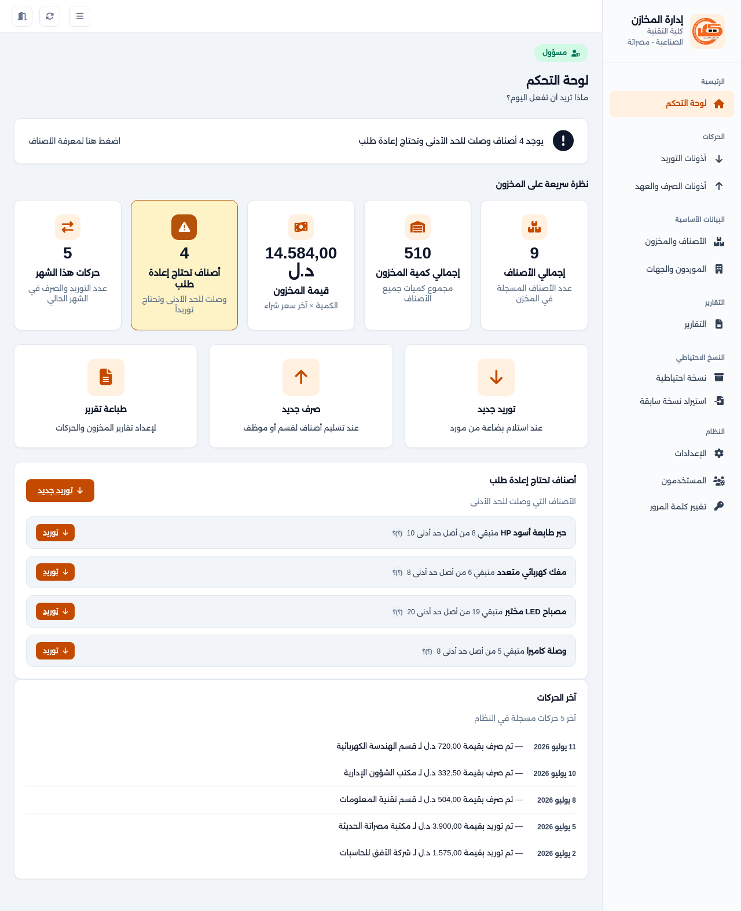
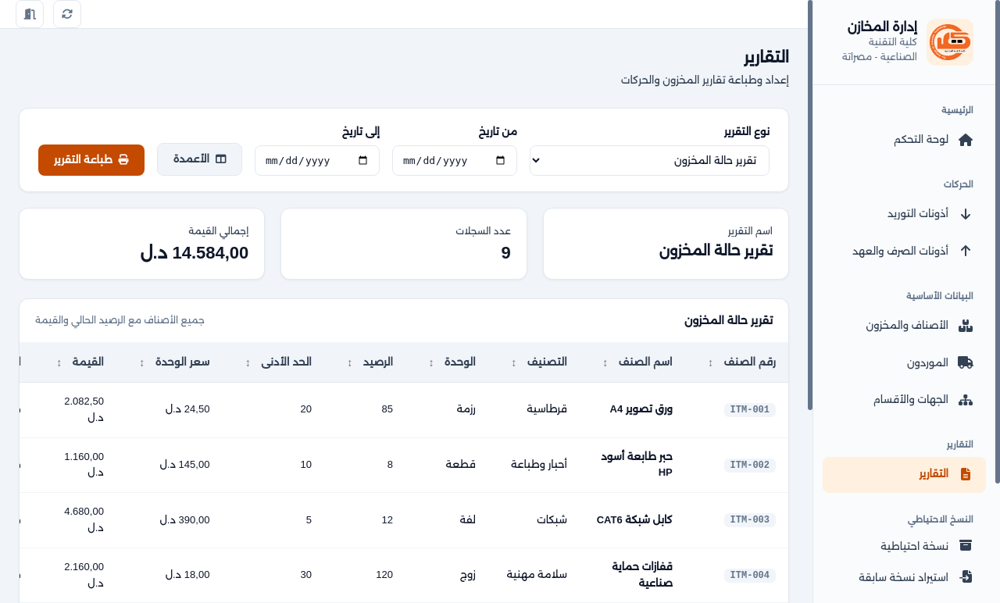
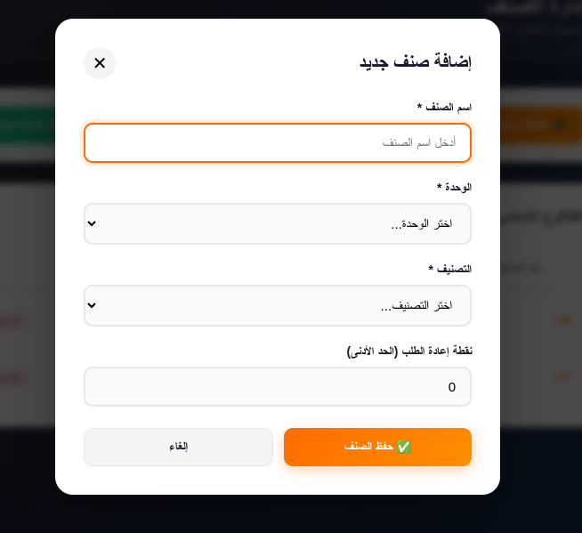

# 📦 منظومة إدارة المخازن (Warehouse Management System)

تطبيق سطح مكتب (Desktop Application) تم تطويره لصالح **كلية التقنية الصناعية** لإدارة المخازن، الأذونات، ومتابعة الأرصدة. تم بناء النظام ليعمل بشكل محلي بالكامل بدون الحاجة لخوادم خارجية، مع التركيز على السرعة، استقرار البيانات، والأمان.

---

## ✨ المميزات الحالية (في النموذج الأولي)
- **قاعدة بيانات محلية سريعة:** استخدام SQLite لحفظ البيانات على جهاز المستخدم محلياً.
- **إدارة الأصناف (الكتالوج):** إضافة، عرض، وحذف الأصناف (باستخدام الحذف المنطقي Soft Delete لضمان سلامة العمليات المحاسبية).
- **التقارير والطباعة:** القدرة على الطباعة المباشرة من النظام أو تصدير التقارير كملفات **PDF** بدعم مثالي ومدمج للغة العربية.
- **متعدد المنصات (Cross-Platform):** يعمل بكفاءة على أنظمة (Windows, Linux, macOS) من نفس الكود المصدري.

---

## 📸 صور من النظام (Screenshots)

*(سيتم تحديث الصور عند اعتماد الواجهات النهائية)*

| شاشة تسجيل الدخول | لوحة التحكم (إدارة الأصناف) |
| :---: | :---: |
|  |  |
| **طباعة التقارير وتصدير الـ PDF** | **إضافة صنف جديد** |
|  |  |

---

## 🛠️ التقنيات المستخدمة (Tech Stack)
- **الإطار الرئيسي:** [Electron.js](https://www.electronjs.org/) (لتحويل الكود إلى تطبيق سطح مكتب).
- **قاعدة البيانات:** [SQLite](https://www.sqlite.org/) عبر مكتبة `better-sqlite3` لأداء متزامن وسريع.
- **الواجهات:** HTML5, CSS3 (Vanilla), JavaScript.

---

## 🚀 كيفية التشغيل في بيئة التطوير (Development)

1. قم بتحميل المستودع:
   ```bash
   git clone https://github.com/your-username/warehouse-system.git
📦 كيفية بناء المشروع للإنتاج (Production Build)

لتحويل المشروع إلى ملفات تنفيذية جاهزة للتثبيت لدى المستخدم النهائي:

لأنظمة ويندوز (Windows .exe):
code Bash

npm run build:win

لأنظمة لينكس (Linux .AppImage):
code Bash

npm run build:linux

(ستجد الملفات النهائية الجاهزة للتثبيت داخل مجلد dist)

الجهة المنفذة: قسم تقنية المعلومات - كلية التقنية الصناعية.
code Code

### نصيحة أخيرة للـ GitHub:
في مجلد المشروع الخاص بك، قم بإنشاء مجلد اسمه `placeholders` وضع فيه 4 صور كـ (Screenshots) للمشروع الحالي، وسمّها بنفس الأسماء المذكورة في الـ README (`login.png`, `dashboard.png`، الخ). هذا سيجعل صفحة الـ GitHub تبدو احترافية جداً للإدارة.

بالتوفيق في عرض المشروع للإدارة! أنتم على الطريق الصحيح لبناء تطبيق صلب واحترافي. متواجد دائماً إذا احتجت للمساعدة في الخطوات القادمة بعد الموافقة.
