# 📦 منظومة إدارة المخازن (Warehouse Management System)

تطبيق سطح مكتب (Desktop Application) تم تطويره لصالح **كلية التقنية الصناعية – مصراتة** لإدارة المخازن، الأذونات، ومتابعة الأرصدة. يعمل النظام بشكل محلي بالكامل بدون خوادم خارجية، مع التركيز على السرعة، استقرار البيانات، والأمان.

**الإصدار الحالي:** `v1.2.0`  
**الترخيص:** MIT

### ما الجديد في v1.2.0

- **هيكل هرمي للجهات**: يمكن الآن تسجيل دائرة ← قسم ← شعبة بأي عمق، مع عرض الشجرة بمسافات بادئة في القوائم والتقارير.
- **اسم المستلم في إذن الصرف**: حقل إلزامي يُسجَّل مع الإذن ويظهر في المستند المطبوع وفوق سطر توقيع المستلم.
- **فصل الموردين عن الجهات**: صفحة مستقلة للموردين الخارجيين وأخرى للجهات والأقسام الداخلية.
- **دوران فقط**: مسؤول وأمين مخزن — دور "المستعرض" أُزيل نهائياً، وكل فحوصات الصلاحيات تُنفَّذ في العملية الرئيسية.

---

## 🎯 نظرة عامة على سير العمل

المستخدم يبدأ بتسجيل الدخول، ثم ينتقل إلى لوحة التحكم التي تخبره مباشرةً بحالة المخزن. من هناك يمكنه إجراء توريد أو صرف، مراجعة التقارير، أو إدارة الأصناف والجهات.

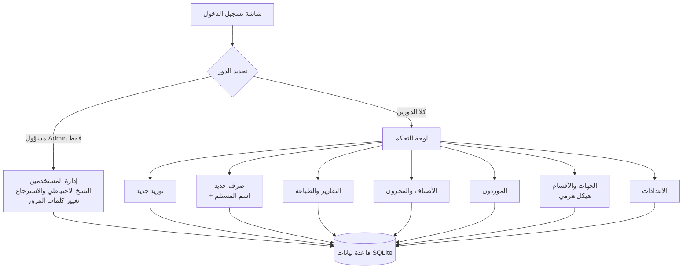
```mermaid
flowchart TD
    A[شاشة تسجيل الدخول] --> B{تحديد الدور}
    B -->|مسؤول Admin فقط| C[إدارة المستخدمين<br/>النسخ الاحتياطي والاسترجاع<br/>تغيير كلمات المرور]
    B -->|كلا الدورين| D[لوحة التحكم]
    D --> E[توريد جديد]
    D --> F[صرف جديد<br/>+ اسم المستلم]
    D --> G[التقارير والطباعة]
    D --> H[الأصناف والمخزون]
    D --> I[الموردون]
    D --> J[الجهات والأقسام<br/>هيكل هرمي]
    D --> L[الإعدادات]
    E --> K[(قاعدة بيانات SQLite)]
    F --> K
    G --> K
    H --> K
    I --> K
    J --> K
    C --> K
    L --> K
```

---

## 👥 الأدوار وصلاحيات المستخدمين

النظام يعتمد **دورين فقط** (دور "المستعرض Viewer" أُزيل، وأي حساب قديم بهذا الدور يُحوَّل تلقائياً إلى أمين مخزن عند أول تشغيل):

| الدور | الوصف | الصلاحيات الرئيسية |
| :--- | :--- | :--- |
| **مسؤول (Admin)** | مدير النظام | كل الصلاحيات: إضافة/تعديل/حذف الأصناف والجهات، إصدار أذونات التوريد والصرف، إدارة المستخدمين (إضافة، تغيير الأدوار، تفعيل/تعطيل، إعادة تعيين كلمات المرور)، إعداد التقارير، النسخ الاحتياطي والاسترجاع. |
| **أمين مخزن (Store_Keeper)** | المستخدم اليومي للمخزن | إضافة/تعديل/حذف الأصناف والجهات، إصدار أذونات التوريد والصرف، إعداد التقارير. **لا يستطيع** إدارة المستخدمين، ولا إنشاء نسخة احتياطية يدوية أو استرجاعها، ولا تغيير أي كلمة مرور (حتى كلمة مروره الخاصة) — هذه الإجراءات مقصورة على المسؤول. |

### الصفحات الظاهرة لكل دور

| الصفحة / الإجراء | مسؤول | أمين مخزن |
| :--- | :---: | :---: |
| لوحة التحكم، الأصناف والمخزون، الموردون، الجهات والأقسام | ✅ | ✅ |
| أذونات التوريد، أذونات الصرف والعهد، التقارير | ✅ | ✅ |
| الإعدادات | ✅ | ✅ |
| المستخدمون (إدارة الحسابات) | ✅ | ❌ لا تظهر |
| نسخة احتياطية / استيراد نسخة سابقة | ✅ | ❌ لا تظهر |
| تغيير كلمة المرور | ✅ | ❌ لا تظهر |

القائمة الجانبية تتكيف تلقائياً مع الدور — أمين المخزن لا يرى أقسام النسخ الاحتياطي وإدارة المستخدمين إطلاقاً، والحماية الفعلية مفروضة في العملية الرئيسية وليس بالإخفاء فقط:

| واجهة المسؤول (كل الأقسام) | واجهة أمين المخزن (بدون النسخ الاحتياطي والمستخدمين) |
| :---: | :---: |
|  | 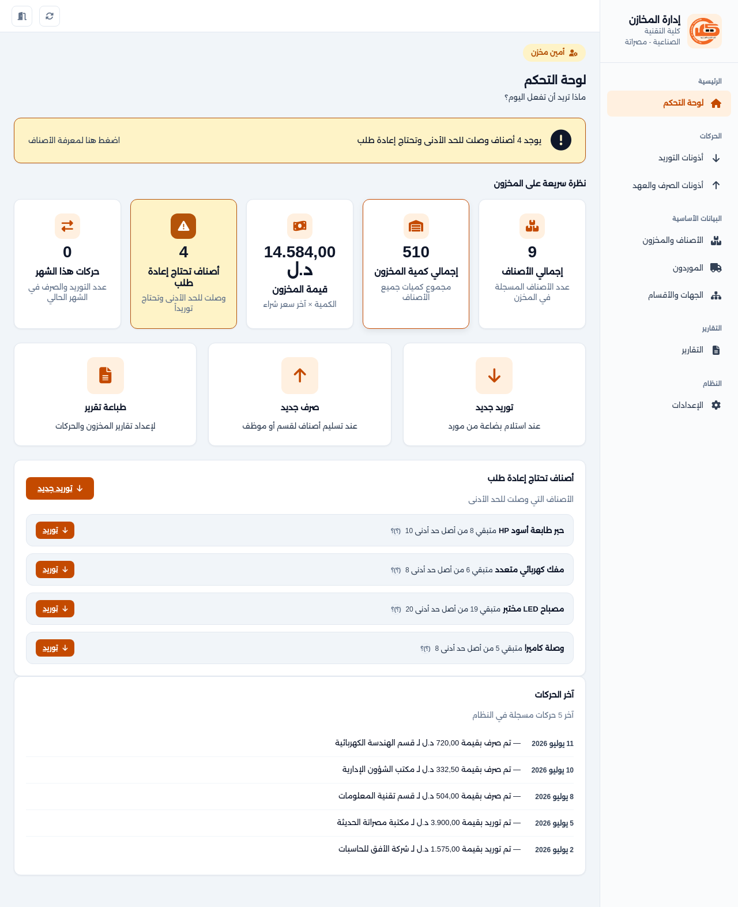 |

> **ملاحظة أمان:** كل فحوصات الصلاحيات تُنفّذ في العملية الرئيسية (main process) على الخادم المحلي، وليس في الواجهة فقط.

---

## ✨ قائمة الميزات والاستخدام

> الصور أدناه لقطات حقيقية من واجهة التطبيق أثناء التشغيل (بيانات تجريبية للعرض) وتم حفظها في مجلد `placeholders/`.

### 1. تسجيل الدخول والأمان
- شاشة دخول بسيطة تطلب الاسم وكلمة المرور.
- كلمات المرور مُخزّنة باستخدام **scrypt** (وليس نصاً واضحاً).
- دعم تغيير كلمة المرور الشخصية.
- المسؤول يستطيع إعادة تعيين كلمة مرور أي مستخدم آخر.

<p align="center"></p>

### 2. لوحة التحكم
- **شريط حالة كبير** يخبر المستخدم بجملة عربية واضحة: "كل شيء على ما يرام" أو "يوجد N صنف تحتاج إعادة طلب".
- عند النقر على شريط التحذير، يتم الانتقال تلقائياً إلى قائمة الأصناف المنخفضة.
- **ثلاثة أزرار رئيسية كبيرة**: توريد جديد، صرف جديد، طباعة تقرير.
- **قسم يحتاج اهتمامك**: يعرض الأصناف التي وصلت للحد الأدنى مع جملة "متبقي X من أصل حد أدنى Y".
- **آخر الحركات**: آخر 5 حركات مكتوبة كجمل عربية (مثال: "أمس — تم صرف 20 قلم حبر لقسم الشؤون الإدارية").
- **ملخص أرقام صغير** في الأسفل: إجمالي الأصناف، قيمة المخزون، حركات الشهر، مع تلميحات توضح معنى كل رقم.

<p align="center"></p>

### 3. الأصناف والمخزون
- إضافة صنف جديد: الاسم، الوحدة، التصنيف، الحد الأدنى، السعر.
- البحث والتصفية حسب الاسم/الرقم/التصنيف.
- تعديل بيانات الصنف.
- حذف منطقي (Soft Delete) لضمان عدم فقدان البيانات المحاسبية.

<p align="center">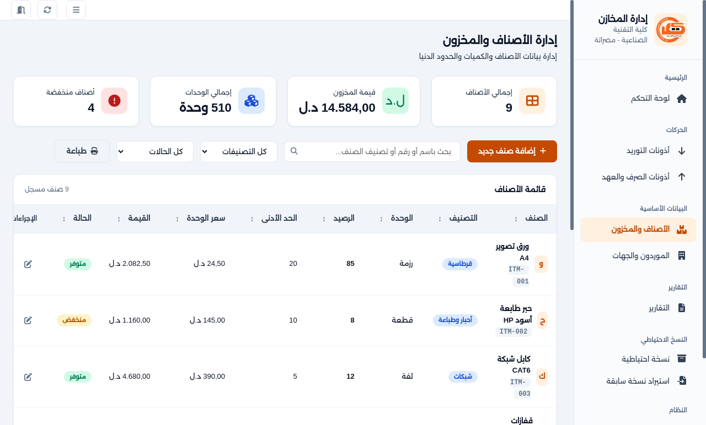</p>

### 4. الموردون
- صفحة مستقلة للموردين الخارجيين (الشركات والتجار الذين تُورَّد منهم الأصناف).
- البحث بالاسم أو رقم الهاتف، مع طباعة دليل الموردين.
- حذف منطقي يحافظ على سجل التوريدات السابقة.

<p align="center">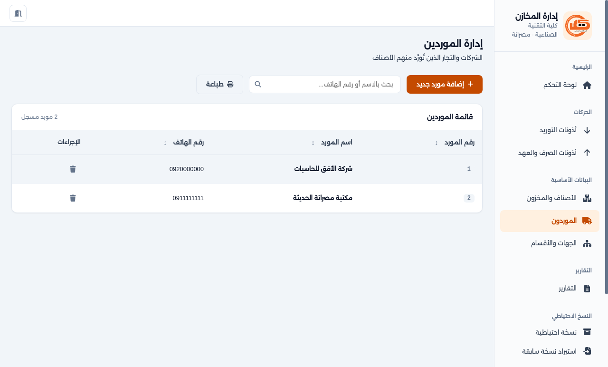</p>

### 5. الجهات والأقسام (هيكل هرمي)
- صفحة مستقلة للجهات الداخلية التي تُصرف لها الأصناف: دوائر، أقسام، شعب، وموظفون.
- **تداخل غير محدود**: قسم داخل دائرة، وشعبة داخل قسم — بأي عمق (مثال: الإدارة العامة ← قسم تقنية المعلومات ← شعبة الصيانة والدعم).
- عند إضافة جهة يمكن اختيار "الجهة الأم" من قائمة منسدلة مرتبة هرمياً.
- الشجرة تظهر بمسافات بادئة في الجدول وفي قائمة الجهة الطالبة بإذن الصرف، مع المسار الكامل عند التمرير فوق الاسم.
- لا يمكن حذف جهة لا تزال تضم جهات فرعية — تُحذف الفروع أولاً.

<p align="center">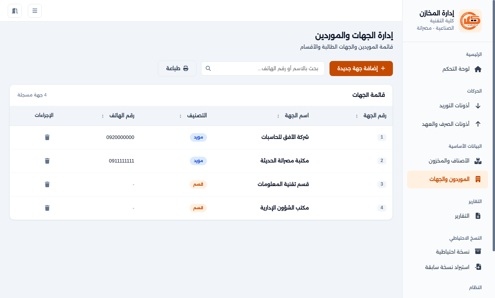</p>

### 6. أذونات التوريد
- اختيار المورد، المخزن، وتاريخ التوريد.
- إضافة عدة أصناف بكميات وأسعار.
- حفظ الإذن والطباعة مباشرة.

| نموذج إذن التوريد | إذن التوريد المطبوع |
| :---: | :---: |
| 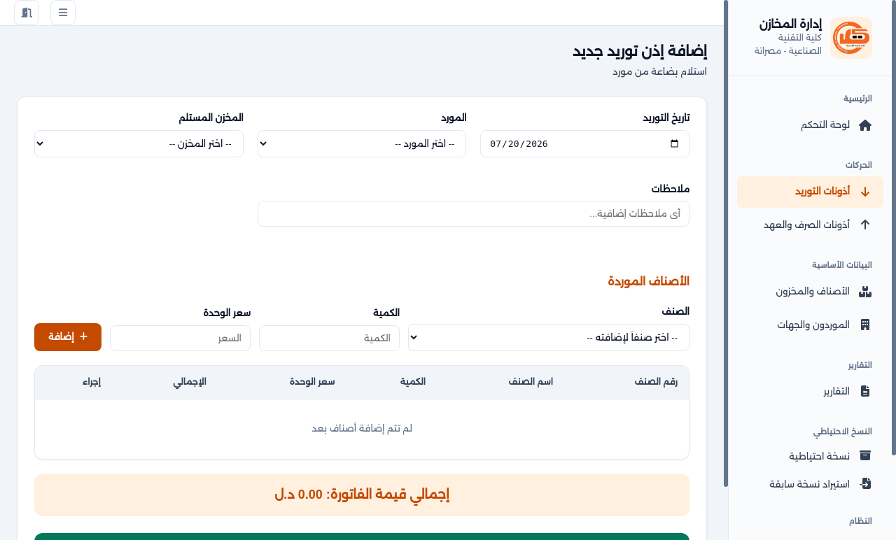 | 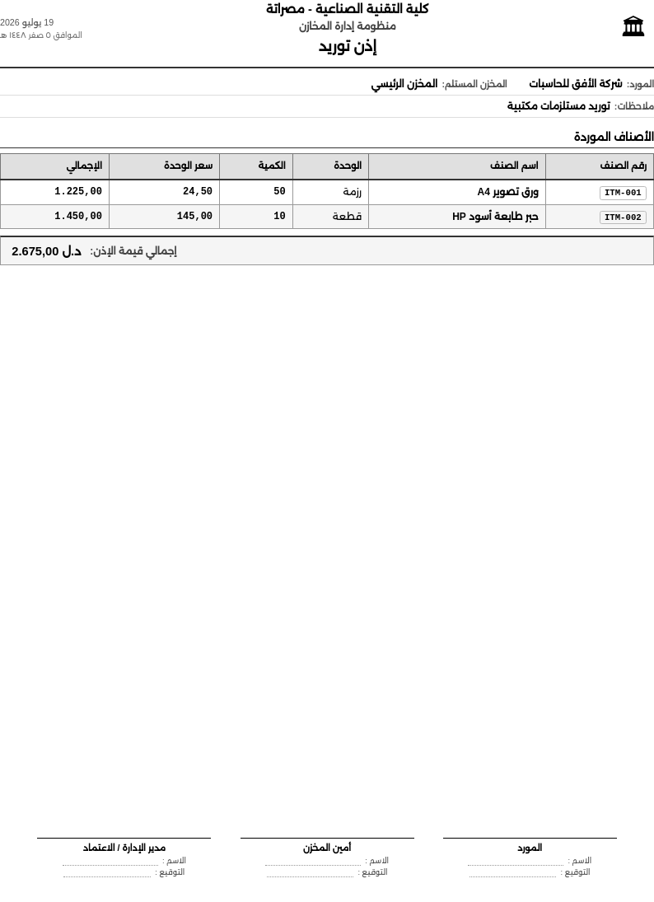 |

### 7. أذونات الصرف
- اختيار الجهة الطالبة من القائمة الهرمية (قسم، شعبة، أو موظف) والمخزن.
- **اسم المستلم حقل إلزامي**: يُسجَّل مع الإذن اسم الشخص الذي استلم الأصناف فعلياً، ويُرفض الحفظ بدونه (التحقق في العملية الرئيسية وليس في الواجهة فقط).
- **التحقق اللحظي من الرصيد**: يمنع صرف كمية أكبر من المتاح.
- الإذن المطبوع يعرض **المسار الهرمي الكامل** للجهة الطالبة (مثال: الإدارة العامة ← قسم تقنية المعلومات) و**اسم المستلم** فوق سطر توقيعه.

| نموذج إذن الصرف | إذن الصرف المطبوع |
| :---: | :---: |
| 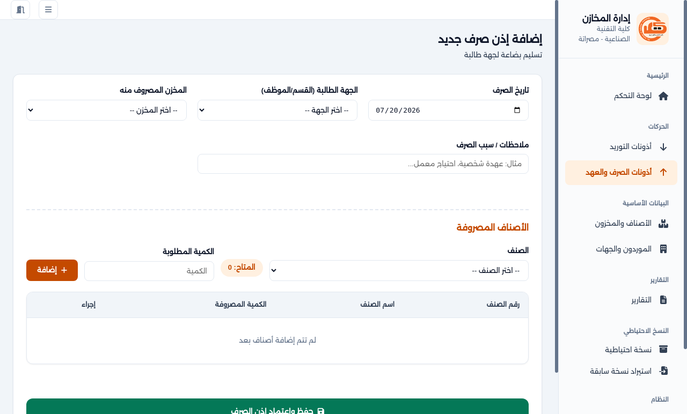 | 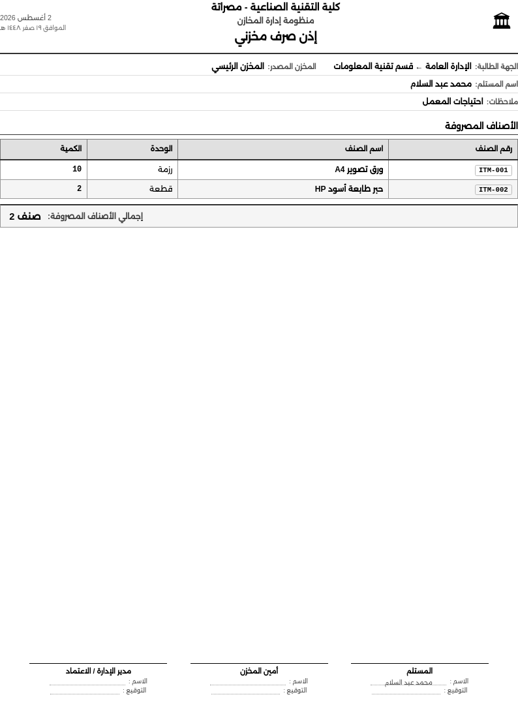 |

### 8. التقارير والطباعة
- تسعة أنواع تقارير:
  1. تقرير حالة المخزون
  2. دليل الأصناف الأساسي
  3. تقرير الأصناف منخفضة الرصيد
  4. تقرير الجرد الفعلي
  5. سجل حركات التوريد والصرف
  6. إذن توريد
  7. إذن صرف
  8. بطاقة حركة صنف
  9. دليل الموردين والجهات
- طباعة منبثقة بقياس A4 مع توقيعات رسمية.
- تصدير/طباعة PDF بدعم اللغة العربية.
- اختيار الأعمدة الظاهرة لكل تقرير.

<p align="center"></p>

| تقرير حالة المخزون | دليل الأصناف الأساسي |
| :---: | :---: |
| 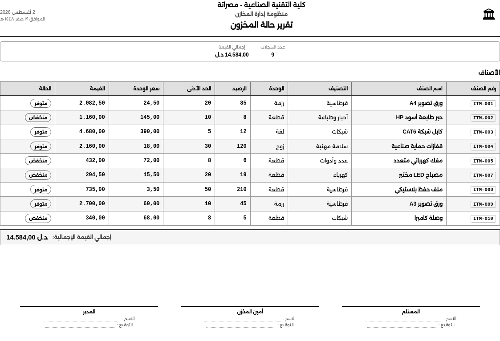 | 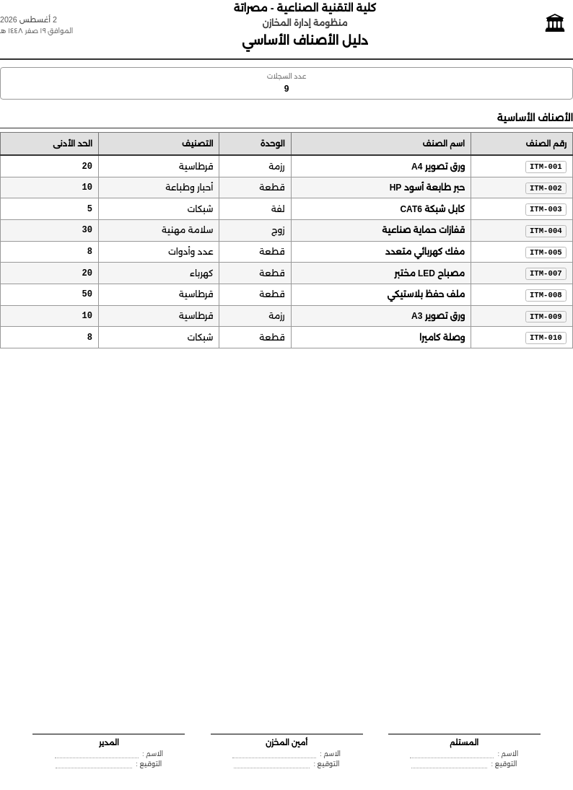 |

| تقرير الأصناف منخفضة الرصيد | تقرير الجرد الفعلي |
| :---: | :---: |
| 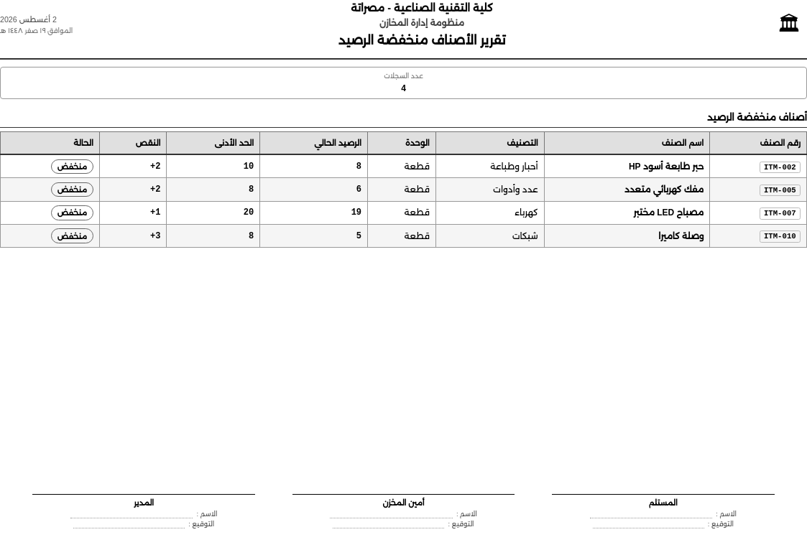 | 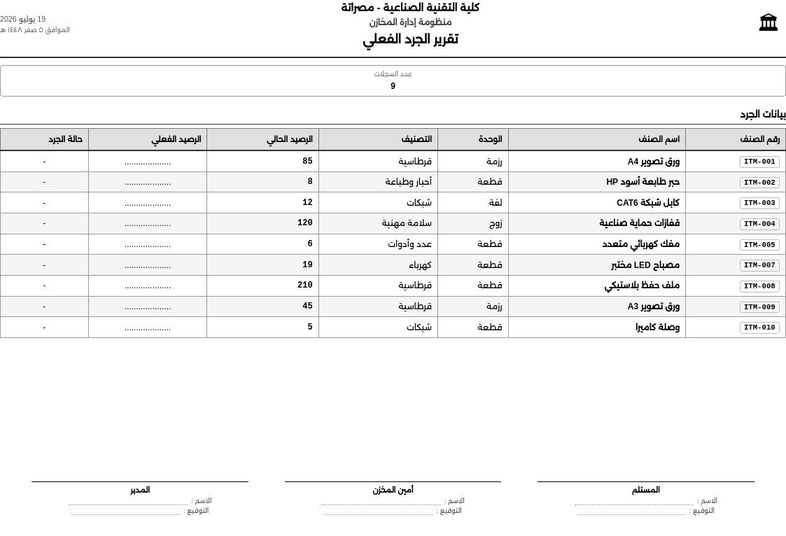 |

| سجل الحركات | بطاقة حركة صنف |
| :---: | :---: |
| 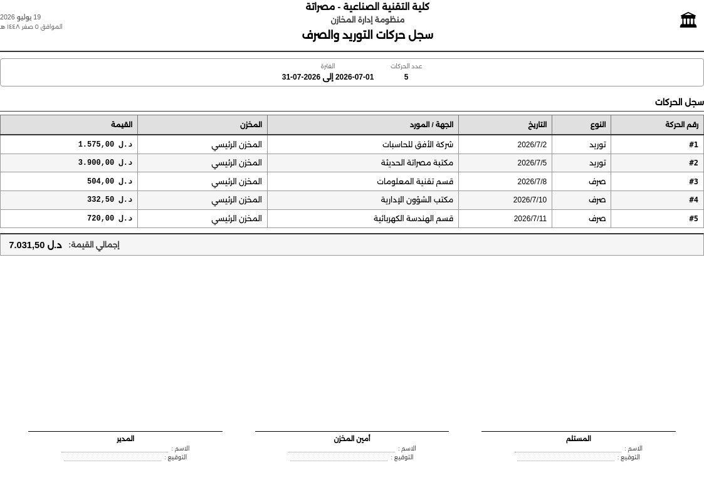 | 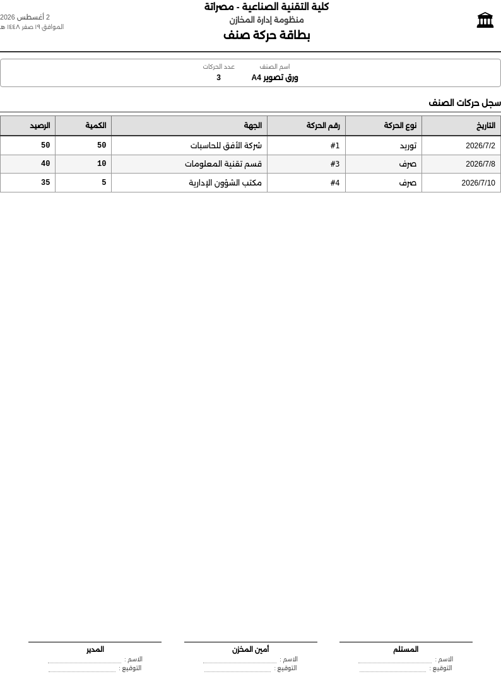 |

| دليل الموردين والجهات |
| :---: |
| 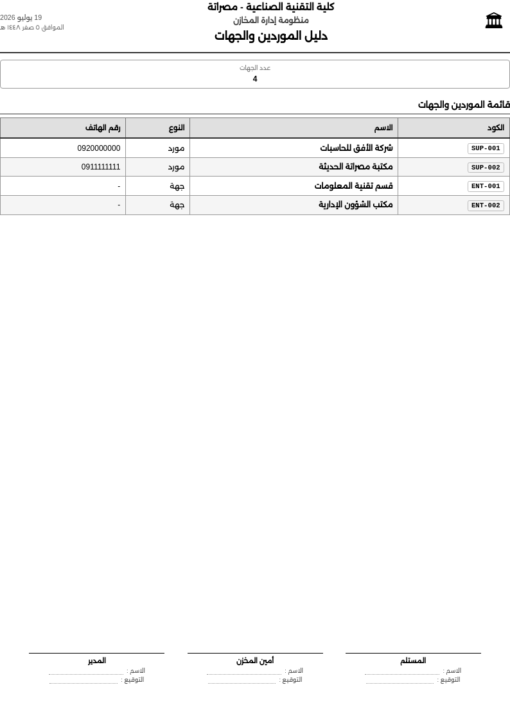 |

### 9. إدارة المستخدمين (للمسؤول فقط)
- إضافة مستخدم جديد بدور مسؤول أو أمين مخزن.
- تغيير دور المستخدم.
- تفعيل/تعطيل الحساب.
- إعادة تعيين كلمة المرور.
- الصفحة لا تظهر في القائمة الجانبية لغير المسؤول، ومحاولة الوصول المباشر تُرفض في العملية الرئيسية.

<p align="center">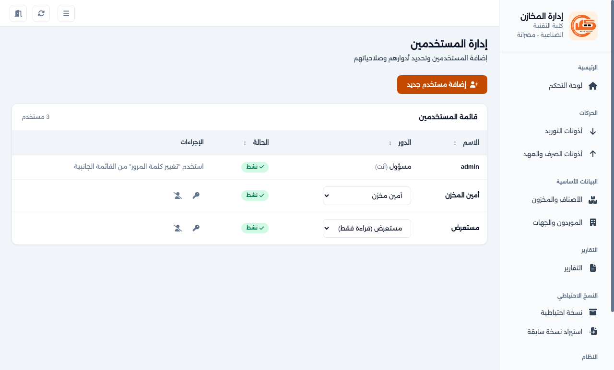</p>

### 10. النسخ الاحتياطي والاسترجاع (للمسؤول فقط)
- نسخ احتياطي محلي تلقائي على نفس الجهاز.
- استرجاع أي نسخة سابقة من سجل Git المحلي.
- النسخ اليدوي والاسترجاع يتطلبان إعادة إدخال كلمة مرور المسؤول.
- المزامنة السحابية معطّلة في هذا الإصدار.

<p align="center">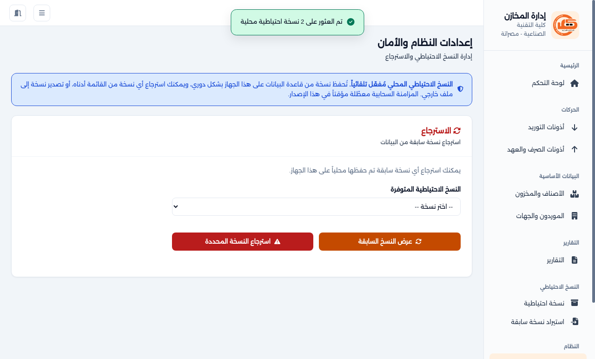</p>

---

## 🛠️ التقنيات المستخدمة (Tech Stack)

| الطبقة | التقنية |
| :--- | :--- |
| الإطار الرئيسي | [Electron.js](https://www.electronjs.org/) |
| قاعدة البيانات | [SQLite](https://www.sqlite.org/) عبر `better-sqlite3` |
| الواجهات | HTML5, CSS3, JavaScript (Vanilla) — لا يوجد إطار frontend |
| الأمان | CSP headers، هروب النصوص (escape)، فحوصات الصلاحيات في main process |
| البناء | `electron-builder` (Windows `.exe`، Linux `.AppImage`/`.deb`) |

---

## 🚀 كيفية التشغيل في بيئة التطوير

**1. تحميل المستودع:**

```bash
git clone https://github.com/RNotmyname/cit.git
cd cit
```

**2. تثبيت المكتبات:**

```bash
npm install
```

**3. تشغيل التطبيق:**

```bash
npm start
```

---

## 📦 بناء الإصدار للإنتاج

**ويندوز (ملف `.exe`):**

```bash
npm run build:win
```

**لينكس (ملف `.AppImage`):**

```bash
npm run build:linux
```

**لينكس (حزمة `.deb`):**

```bash
npm run build:linux-deb
```

---

## 🔐 ملاحظات أمنية

- النظام يعمل محلياً بالكامل؛ لا توجد اتصالات خارجية.
- صلاحيات الكتابة تُمنح فقط لـ **المسؤول** و**أمين المخزن**.
- النسخ الاحتياطي اليدوي، الاسترجاع، وتغيير كلمات المرور (حتى الذاتية) مقصورة على **المسؤول** فقط.
- يتم منع صرف أي كمية تتجاوز الرصيد المتاح قبل حفظ الإذن.

---

## 📄 الملفات الرئيسية

| الملف | الغرض |
| :--- | :--- |
| `main.js` | العملية الرئيسية لـ Electron، معالجات IPC، قواعد البيانات |
| `preload.js` | جسر IPC الآمن بين الواجهة والعملية الرئيسية |
| `database/db.js` | إعداد قاعدة البيانات والاتصال |
| `assets/js/pages/*.js` | منطق كل صفحة |
| `assets/css/*.css` | الأنماط المشتركة بين الصفحات |
| `release/` | مخرجات البناء الجاهزة للتوزيع |

---

> **الجهة المنفذة:** قسم تقنية المعلومات — كلية التقنية الصناعية.
